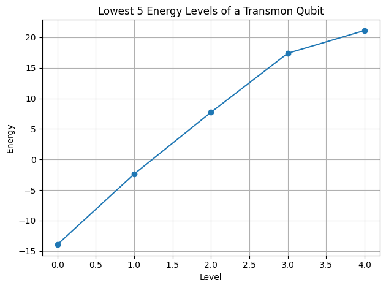

# Transmon Qubit Simulation and 1-Qubit IBM Backend Demo

This repository implements a **Transmon qubit simulation** using Python and Qiskit.  
It computes the **energy levels**, simulates **time evolution** in the charge basis, extracts the **energy spectrum**, and demonstrates a simplified **1-qubit quantum circuit approximation** using IBM Quantum backends or the AerSimulator.

The Transmon is a superconducting qubit widely used in quantum computing due to its **reduced sensitivity to charge noise**, making it highly coherent. This simulation models the **Hamiltonian in the charge basis**, evolves the initial state \(|n=0\rangle\) over time, and analyzes the resulting dynamics.

---

## 🚀 Features
- **Transmon Hamiltonian Construction**
  - Uses a **finite charge basis** from \(-n_\text{max}\) to \(n_\text{max}\)  
  - Diagonal terms: charging energy \(4 E_C n^2\)  
  - Off-diagonal terms: Josephson tunneling \(-E_J/2\)  
- **Energy Level Analysis**
  - Computes **lowest 5 energy eigenvalues**  
  - Calculates **energy gaps** \(\Delta E_i = E_{i+1}-E_i\)  
- **Time Evolution**
  - Evolves \(|n=0\rangle\) via **matrix exponentiation** \(U(t) = e^{-i H t}\)  
  - Calculates **overlap probabilities** as a function of time  
- **Fourier Spectrum**
  - Computes **frequency spectrum** from time-evolved overlaps  
  - Reveals dominant energy differences (transitions)  
- **1-Qubit Circuit Approximation**
  - Uses **theta and phi rotations** to approximate the Transmon evolution on a single qubit  
  - Can run on **IBM backends** or **AerSimulator**  
- **Visualization**
  - Lowest 5 energy levels  
  - 1-qubit probability distribution  
  - Energy spectrum from Fourier transform  

---

## ⚙️ Usage

1. **Run the script** in Python or Google Colab.
2. Input simulation parameters (or press Enter for defaults):
   - `EC` → Charging energy (default: 1.0)  
   - `EJ` → Josephson energy (default: 20.0)  
   - `n_max` → Maximum charge state (default: 30)  
   - `time` → Simulation time (default: 1.0)  
3. For IBM Quantum backends:
   - Enter **API key**, **instance name**, and **backend name** (e.g., `ibm_brisbane`)  
   - If unavailable, the script automatically falls back to **AerSimulator**  
4. The script will:
   - Build the **Transmon Hamiltonian**  
   - Perform **time evolution** of \(|n=0\rangle\)  
   - Compute **energy spectrum** via Fourier transform  
   - Approximate 1-qubit evolution on **quantum circuit**  
   - Plot energy levels, probabilities, and spectrum  

---

## 📊 Results

**Final 1-Qubit Probabilities (IBM Backend):**

| State | Probability |
|-------|-------------|
| 0     | 0.667       |
| 1     | 0.333       |

**Energy Gaps (from eigvalsh):**

> These gaps correspond to the energy differences between the lowest 5 eigenstates of the Transmon Hamiltonian.

---

### Plots

1. **Lowest 5 Energy Levels**

2. **Time Evolution**

3. **Transmon Energy Spectrum via Time Evolution**

> Save generated plots as `energy_levels.png`, `transmon_1qubit.png`, and `spectrum.png` in your repo folder to display them in GitHub README.

---

## 📚 References
- [Qiskit Documentation](https://qiskit.org/documentation/)  
- [Transmon Qubit Model](https://arxiv.org/abs/cond-mat/0312182)  
- [Quantum Circuit Simulations](https://qiskit.org/documentation/tutorials/circuits/1_getting_started_with_qiskit.html)  

---

## ⚠️ Notes
- Finite charge basis (`n_max`) approximates the infinite Hilbert space.  
- **Matrix exponentiation** provides exact time evolution for small Hilbert spaces.  
- The **1-qubit circuit** is a simplified demonstration; full multi-level Transmon dynamics are not captured.  
- Results on IBM backends may vary due to **quantum noise**.
